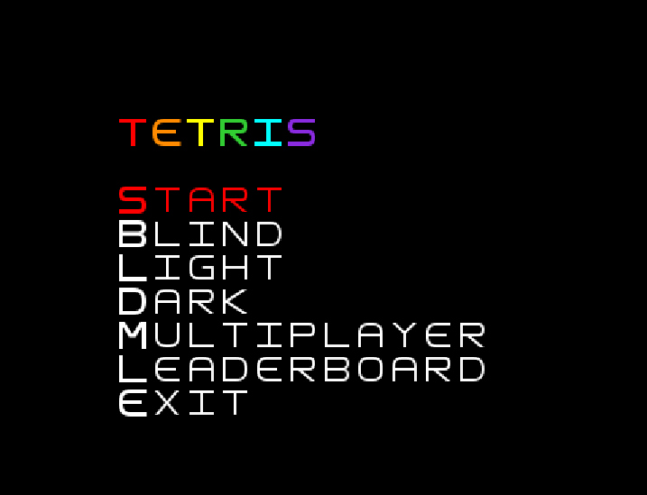
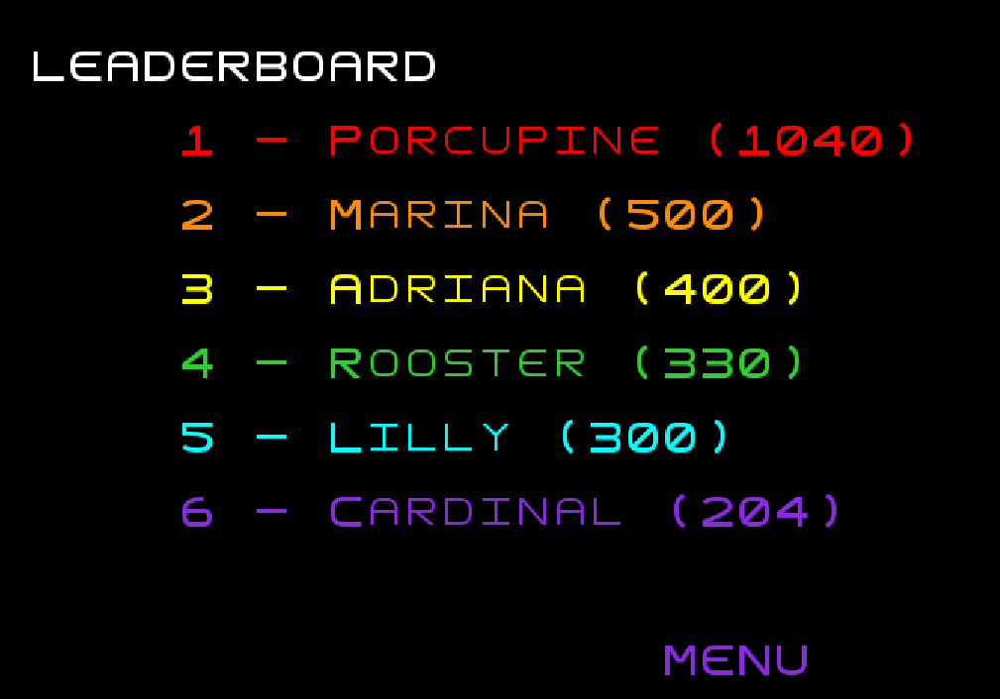
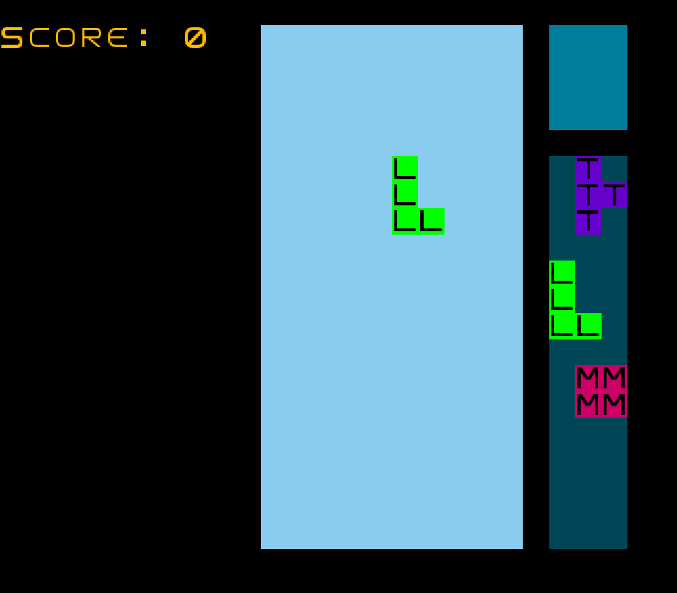
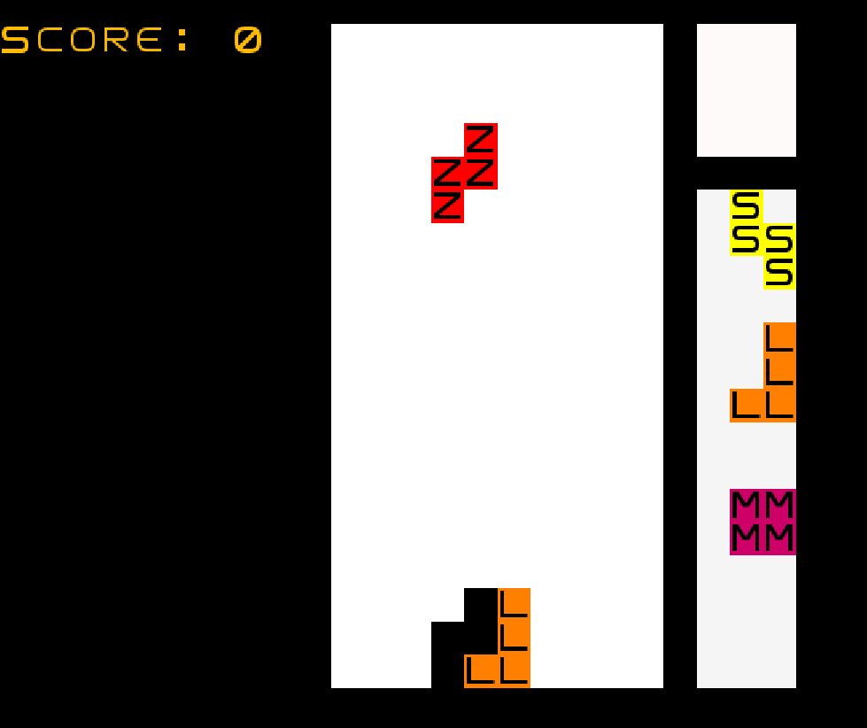
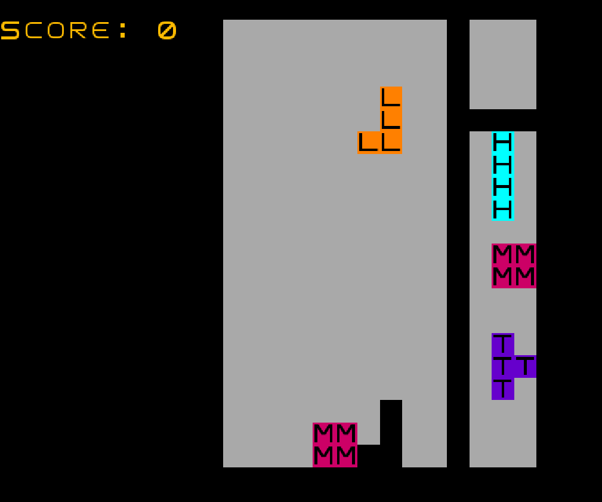
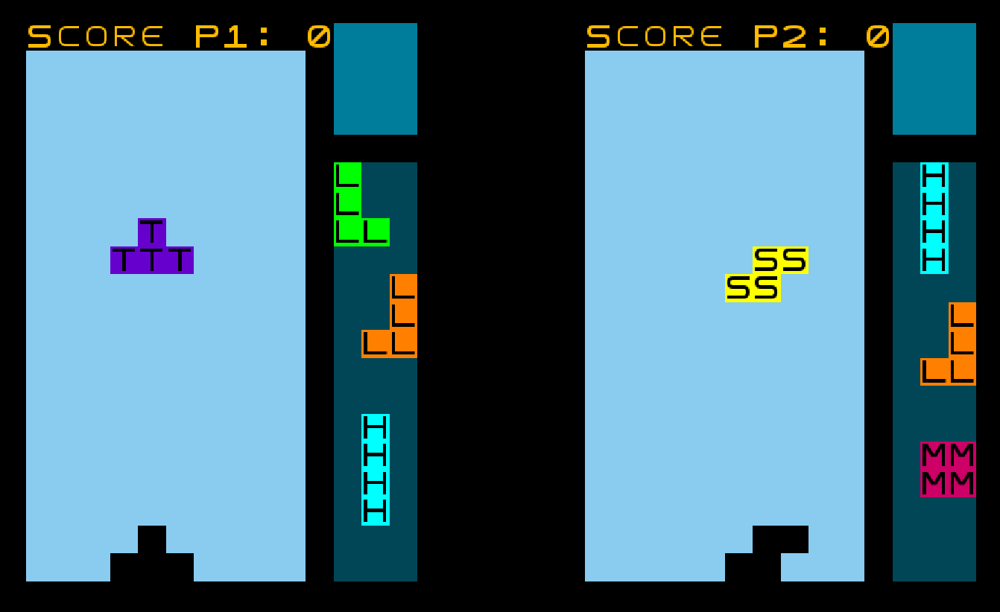
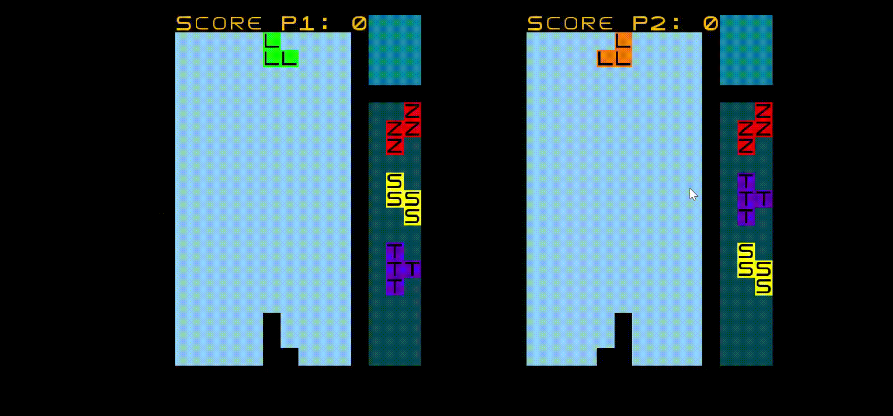

# **LPOO_31 -  TETRIS GAME**

This project was developed by:

[Henrique Sousa (Self)](https://github.com/henriquecscode)

[Mateus Silva](https://github.com/lessthelonely)

[Melissa Silva](https://github.com/melisilva)

## **Game Modes**

- *Single Player* ("Start"): normal *Tetris*, with score, ghost piece and levels (each 5 lines speeds up the gameplay);

- *Dark and Light Modes* ("Dark" and "Light"): same game as *Single Player*, but with different colors;
- *Blind Mode* ("Blind"): essentially, the same as *Single Player*, except you can't see the pieces already placed on *Board* - if one wishes to see 'em, clear a line to have glimpse at it - it has no ghost piece;
- *Multiplayer Tetris*: 1v1 *Tetris*, without *Levels* - the winner shall win on pure skill alone;

## **Other Buttons**

- *Leaderboard:* if one has obtained a good score, they might be immortalized with a spot on the *Leaderboard* - they'll get an animal name and everything;
- *Exit*: pretty self-explanatory.

## **Keyboard Controls**

### **Single Player**

|              Action              | Keys                                                    |
| :------------------------------: | :------------------------------------------------------ |
| Horizontal and Vertical Movement | Arrow Keys (except Up)                                  |
|            Drop Piece            | Space Bar                                               |
|            Hold Piece            | *N*                                                     |
|             Rotation             | *B* for Left Rotation  *M* for Right Rotation |

### **Multiplayer**

##### Player 1

|              Action              | Keys                                                    |
| :------------------------------: | :------------------------------------------------------ |
| Horizontal and Vertical Movement | Arrow Keys (except Up)                                  |
|            Drop Piece            | Space Bar                                               |
|            Hold Piece            | *N*                                                     |
|             Rotation             | *B* for Left Rotation  *M* for Right Rotation |

##### **Player 2**

|              Action              | Keys                                                    |
| :------------------------------: | :------------------------------------------------------ |
| Horizontal and Vertical Movement | *A* for Left *S* for Down *D* for Right       |
|            Drop Piece            | *E*                                                     |
|            Hold Piece            | *X*                                                     |
|             Rotation             | *Z* for Left Rotation  *C* for Right Rotation |

## Feature List

- 7 types of Tetris Pieces;
- Collisions;
- Horizontal, Vertical and Rotation-based Movements;
- Ghost Piece;
- Drop Piece;
- Hold Piece;
- Leaderboard;
- Blind Mode;
- 1v1 Multiplayer;
- Dark Mode;
- Light Mode;
- Keyboard Support;
- Menu;
- Line Clearing;
- Piece Queue;
- Score.

## **Screenshots**

**Menu**

**Start - Single Player Mode**

**Line Clearing + Score Increased**

**LeaderBoard** 

**Blind Mode**

**Light Mode**

**Dark Mode**

**Multiplayer Mode**

## **Gifs**

**Start - Single Player** 

**Blind Mode**

**Light Mode**

**Dark Mode**

**Multiplayer Mode**

