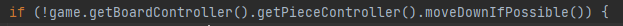

# **LPOO_31 -  TETRIS GAME**
<h2>Introduction</h2>

Our group project for LPOO will be developing a replica of Tetris, with some added Game Modes (Multiplayer and an original mode we dubbed Blind Tetris, where the players cannot see the pieces as they place 'em on the board).

This project was developed by:

<table>
<tr>
<td>
Henrique Sousa
</td>
<td>up201906681@fe.up.pt
</td>
</tr>
<tr>
<td>
Mateus Silva
</td>
<td>
up201906232@fe.up.pt
</td>
</tr>
<tr>
<td>
Melissa Silva 
</td>
<td>
up201905076@fe.up.pt
</td>
</tr>
</table>

## IMPLEMENTED FEATURES

In this section we'll discuss the features implemented in the Game, showcasing how we did them and how, in the end, it all works.

### **Keyboard Support**

This was one of the first features we introduced to the project as it's a core part of the gameplay: for *Player 1*, we used the following key mapping:

- **Arrow Keys (except Up):** for horizontal and vertical movement, always towards the bottom of the screen;
- **Space Bar**: to instantly drop a piece in the position shown by the *Ghost Piece*;
- **Q Key**: to close the game;
- **N Key**: to hold a piece we don't want to place on the Board currently but might want to later;
- **M Key**: clockwise piece rotation;
- **B Key**: counter-clockwise piece rotation.

For *Player 2*, in Multiplayer Mode, we will use a different key mapping with all new keys.

### **Piece Movement + Collisions**

This movement is controlled by the keys specified above, allowing for the expected movements of a Tetris piece: Left, Right, Down, Drop, Clockwise Rotation and the added Counter-Clockwise Rotation. All of this was achieved in *PieceController*.

The pieces also fall on their own as time passes - every 1000 millisseconds, they go down 1 vertical position.

### **Piece Queue**

A rectangular section showing the following three pieces that will become current pieces in future cycles, should the player be skilled enough to reach those.

### **Hold Piece**

This feature is mapped to the *X* key, as mentioned before: in its early implementation, the *Current Piece*, present in *Board* can be saved within this class, which keeps said instance of *Piece* until it is used again - it is not possible to change the held piece more than once in 1 cycle, meaning the following sequence of events is possible:

```
NEW CURRENT PIECE 1 THE PLAYER DOESN'T LIKE
PLAYER SAVES PIECE 1
NEW CURRENT PIECE 2
PLACE PIECE 2
NEW CURRENT PIECE 3 THE PLAYER DOESN'T LIKE
PLAYER SAVES PIECE 3
CURRENT PIECE IS NOW PIECE 1
PLACE PIECE 1
...
```

But the following is not:

```
NEW CURRENT PIECE 1 THE PLAYER DOESN'T LIKE
PLAYER SAVES PIECE 1
NEW CURRENT PIECE 2 THE PLAYER DOESN'T LIKE
PLAYER SAVES PIECE 2
```

In other words: after saving a piece, the player can only change the held piece after placing, at least, one new piece.

### **Line Clearing**

When a line is full, it is cleared from the Board. The remaining pieces move down accordingly.

The *Board* data structure inside the class of the same name is filled with *Boolean* values - *True* means the spot is filled, *False* means it's empty. Thus, to check if a line is filled, it's required to check if it has any *False* values. When a line is cleared, whatever was above it moves one line down.


### **Ghost Piece**

We thought this feature was highly needed to for gameplay purposes, as without it we figured it'd be pretty hard to play any of the simpler modes. A *ghost piece* is merely a sort of reflection of the current falling piece at the bottom of the *Board* - it helps the player place the current piece exactly where they wish for it to be placed and takes into account pieces that have already been placed on the *Board*, thus not allowing for any sort of intersection between pieces.


This feature is achieved by creating a copy of the current piece for every cycle of the game - as we've established a game is comprised of cycles, each one containing one new falling piece that is placed before the cycle ends. Every time a current piece is moved or rotated, the copied piece's position is reset to whatever position the original piece has, then, it's vertical position is lowered until the piece collides with either the *Board*'s base or a piece that was placed on the *Board*.

One of the places where the feature is handled is in the *step()* function of *BoardController*.


### **Dark & Light Modes**

These two modes are simply the same *Tetris* game with a new coat of paint, quite literally: *Dark Mode* uses darker colors for anyone who wishes to *Tetris* their way to happiness during the night, while *Light Mode* is made for people with 20/20 vision who are OK with burning their retinas - which means everything is the brightest, purest white color.

Here is how the *Dark Mode* looks. As we care for our reader's vision, we will not show how the *Light Mode* looks, but trust us: it's bright.


This new look is achieved through specific *Viewer* type classes that swap out the colors used to draw the Board in the normal, basic mode.

In both modes, the *Ghost Piece* maintains its black color; the *tetrominoes* do the exact same, to keep their identity tied to their colors and as a sort of visual signal to the player.

### **Blind Mode**

*Blind Mode* is probably the hardest mode in the game, limiting the way a Player can interact with the *Board*: playing this mode requires a lot of memorization as the player can only see the pieces placed on the *Board* every time they clear at least a full line, and only for a fleeting moment. The function *drawPieces()* from *BlindGameViewer* takes care of this little "flashing".


*Blind Mode* does not feature a *Ghost Piece* as that would indirectly let a Player "see" the pieces on the *Board*.

### **Multiplayer**

The *Multiplayer* mode allows 2 players to use one keyboard to battle it out and see who remains supreme in a 1v1 Tetris Battle - like *Tetris 99*. When entering this mode, the Players are greeted to a screen featuring two similar but different *Tetris* boards. Each one is controlled by a different key set:

**Player 1** can do horizontal and downwards movement through the 3 bottom arrow keys (left, down and right), *B* and *M* allow for left and right rotations, *N* to hold a piece and the *Space Bar* to drop a piece.

**Player 2** can do horizontal and downwards movement through the *A*, *S*, and *D* keys (left, down and right respectively), *Z* and *C* allow for left and right rotations, *X* to hold a piece and the *E* to drop a piece.

This game mode does not include *Levels*, but it does include *Scores* that can end up in the game's *Leaderboard*. The only way for the game to finish is for both the Players to lose or for the *Q* key to be pressed, which makes the game return to its *Menu*. Returning to *Menu* does not mean scores don't enter the *Leaderboard*. 


This game mode is achieved through a different controller, *MultiplayerController*, which checks for the inputs obtained through keyboard and associates them with either the 1st Player's *Board* or the 2nd Player's *Board*. It also used a different *Viewer* class named *MultiplayerViewer* which draws the two *Board* instances in a fixed place - the first player is on the left, the second player is on the right.

Finally, there's a *MultiplayerTetris* class that includes two different instances of the *Tetris* class - which we'd call our main class and the one directly used for all game modes except this one.


### **Levels**

*Levels* reward a Player's skill by providing him with a bigger challenge: every time they clear 5 lines, the Game gets a bit quicker - specifically, the current waiting time for pieces to fall one space downward is reduced to 2/3 of its original value.

This is done by counting the total amount of lines cleared by the Player, which is done in the _step()_ function of *BoardController*.


### **Score**

The only objective way to distinguish two *Tetris* players is through a score, so we added a point system that attributes points based on line clearing. To do so, we devised a Mathematical expression that we felt was fair - this fairness translates in the idea that clearing one line is worth 100 points, then clearing *x* lines at once should warrant 100 times *x* plus a little *Combo* bonus.
$$
Score(x) = (100) * (1 + 0.10 * (x - 1))
$$
This warrants the counting of cleared lines every time a piece is placed on the *Board*, which is done by calling the *clearBoard()* function in the mentioned class.


### **Menu**

This feature was required and also needed, taking into account the different modes we wished to implement. It works through keyboard input, namely the *Up* and *Down* arrow keys and the *Enter* key to select an highlighted option.


This is achieved through the *State* Design Pattern, cycling through a list of _Entries_ (as String instances) that when selected start the desired modes, go to the *Leaderboard* screen or, put simply, *Exit* the game and close its window. 


The remaining logic is explained in the *Design* section.

### **Leaderboard**

To permanently store a Player's high-score, the *Game* features a *Leaderboard* screen that lists the 6 highest obtained scores while playing the game - there is no distinction between two equal scores each obtained in a different game mode. The rule is that to enter the *Leaderboard*, a score has to **surpass** the lowest saved high-score - i.e.: if the lowest saved score is 100 points and a Player got 100 points in their game, they will _not_ enter the *Leaderboard*, sadly.

Players are identified through a randomly assigned animal name - for example, *Zebra*. To identify themselves, players need to be wary of their score when they lose, but it's also important to add that when a game ends, if a Player placed in the *Leaderboard*, the game will automatically go that screen.


The *Leaderboard* is saved in two Lists, one of Strings and other of Integers. To maintain a permanent *Leaderboard* whose placing doesn't disappear whenever the game is closed and rebooted, the *Leaderboard* class uses a .txt file that's unpacked and restored every time the game is booted up and closed, respectively. 

The constructor takes care of unpacking a *Leaderboard.txt* file in our resources folder.


A function named _save()_ takes care of restoring the file, which is deleted whenever it is unpacked, putting the potentially updated Leaderboard data in it in a specific format - player designation (animal name) and score separated by a comma; each line is a placing.


## LEFTOVER FEATURES

Thankfully, all the planned features listed in the intermediary report were implemented!

## DESIGN

### **State**

This is a *behavioral* design pattern that allows for a class to enact different actions/behave differently depending on which *state* it is on, as if it is an entirely different object. It is a solution for whenever a state machine is needed within a program - in this case, our state machine is the program's *Menu*.

There are a bunch of different states present in our program: each game mode is a state, along with the program's *Menu* and the *Leaderboard* screen. Each of these states is then given its own, concrete class that deals with the its state-specific behaviors and implements a general *State* interface which lists all the general/common actions each concrete state can enact. 

The structure of this design pattern includes three main components:

- *Context*: stores a reference to one of the concrete state objects and delegates it to all the state specific work;
- *State* and *Concrete States*: an interface and classes that implement it;

This design pattern is used for its intended purpose in our program: it allows us to jump between our different states, from game modes (*Start*, *Blind*, *Light*, *Dark*, *Multiplayer*) to the *Leaderboard* and also allows for the program to be exited. 

Each of the "states" mentioned is, in fact, an implementation following the *Model, View, Controller (MVC)* design pattern, which we'll discuss below.

### **Model, View, Controller (MVC)**

We were advised to follow a **Model View Controller** Design Pattern for our Project, and so, we did. To better understand how this pattern is applied in our Project, we did the following simplified UML diagram.


To be a little bit more verbose, the **MVC** Design Pattern features three main components that, as expected, interact with each other in very programmed and calculated ways: *Model* represents the data that will be used in the program, *View* represents said data graphically and forwards certain events to the *Controller*, which is where user input is obtained and dealt with and said events are processed through the program's internal logic.

To provide a more specific situation made from our project: *Model*, for example, includes the *Board*, which is where *Pieces* are placed. To place a *Piece*, the user must use the keyboard to move and rotate the piece to their liking, which is possible thanks to the *Controller* classes. All of this is shown on screen by *View*, through the *Lanterna* library.

#### **Model**

In our full program, there are a few *Model* type classes - for simplicity, we will address them all generally as each has a few intricacies of its own, pertaining to their own type of gameplay (*Multiplayer*, *Single Player ("Start")*). The exceptions are then *Leaderboard* - which pertains to no gameplay and only stores and updates the placing list - and *Menu*, which takes part in a very simple state machine that leads to the gameplay based models.

The most interesting  *Model* to analyze would be the *Single Player*, whose package is named *tetris*. It encompasses a reasonably big list of Classes:

- **Board**: this features a 2D data structure that represents the actual Board as data, a current piece to potentially be placed on the Board permanently and methods used by Controller classes, namely checking for full lines and clearing them, checking for occupied spots on the Board, filling occupied spots, etc;
- **Player**: used to represent the player through a designation (animal name);
- **Tetris**: it deals with some of the game's logic, mainly getting the new pieces (randomly) and manages our *Piece Queue*.

Here is a first UML detailing more of the connections between these classes.


- **Piece**: a general class that implements a **TetrisPiece** interface that generalizes all functions needed for a Tetris *Piece*: horizontal and vertical movement and rotation, while also including a variable that keeps its orientation and a data structure that defines its shape (for drawing and collision purposes) - its full usage is only achieved through its extensions, one for each of the seven different pieces available: square, line, z, s, t, L and inverted L;

Here's an UML diagram for **Piece** alone.


#### **Viewer**

In our full program, there are a few *Viewer* type classes - for simplicity, we will address them all generally as each has a few intricacies of its own, pertaining to their own type of gameplay (*Multiplayer*, *Single Player ("Start")*, *Blind*) and colors (*Dark* and *Light*). The exceptions are then *Leaderboard* - which merely shows the placing list on screen - and *Menu*, which shows "buttons" that when selected go into different game modes, into *Leaderboard* or that Exit the program.

At their core, all viewers draw a *Board*, *Pieces* (pieces placed on *Board*, the current piece and respective ghost piece), and sections for the held piece and for the piece queue (each with their respective drawn pieces as well). Finally, they also draw a simple score text (two in case of *Multiplayer*).

#### **Controller**

In our full program, there are a few *Controller* type classes - for simplicity, we will address them all generally as each has a few intricacies of its own, pertaining to their own type of gameplay (*Multiplayer*, *Single Player ("Start")*). The exceptions are then *Leaderboard* - which pertains to no gameplay and only stores and updates the placing list - and *Menu*, which takes part in a very simple state machine controlled through its own *Controller*.

The most interesting  *Controller* to analyze would be the *Single Player*, whose package is named *tetris*. It encompasses a reasonable populated controller group:

##### **Game Controller**

This is an abstract class that is extended in both *BoardController* and *PieceController* that extends *Controller*.

##### **Board Controller**

This *Controller* features the game's input, logic and piece dropping that is called every frame of the Main Loop. Pieces will not drop every frame, but only after a designated time. The following pseudocode is a bit more specific on what is done:

```pseudocode
WHILE GAME ISN'T OVER
	GET OUR CURRENT MOMENT (NOW)
	IF MORE THAN 1 SECOND HAS PASSED WITHOUT A DROP
    	LAST_DROP_TIME = NOW
		IF PIECE CAN'T GO DOWN ANYMORE
			PLACE PIECE IN BOARD
	CLEAR ALL FILLED LINES FROM BOARD
	UPDATE VIEW
	CHECK FOR GAME OVER CONDITION
	GET NEXT USER ACTION
CLOSE VIEW
```

This is loop also includes a few other things pertaining to other features, namely the *Levels* feature, which reduces the **1 SECOND** mentioned to 2/3 each time the player goes up a level; it also includes part of the *Ghost Piece*'s logic after **GET NEXT USER ACTION**.

##### **Piece Controller**

This Class enacts all the features needed for a *tetromino*: horizontal movement, vertical movement, rotation and collisions. As every *Piece* instance includes its current coordinates in the *Board*, movement that follows a straight line is simplified into a single function call, *doAction().*

As all a *Player* can directly control is the current falling piece in each game cycle, this function deals with user input and their respective desired actions: *RIGHT*, *DOWN*, *LEFT,* *LEFT ROTATION*, *RIGHT ROTATION*, *DROP* and *HOLD*.

Other than that, the Class includes needed functions to deal with collisions in more than one context (for example, *testCollision()*): not only are Collisions taken into account when placing pieces on the board, but also when rotating - otherwise, a piece could have a part of itself out of bounds, which isn't supposed to happen.

These needed functions usually end with *IfPossible* in the name, and, as the suffix of their name suggests, they check if it is possible to enact their respective action: for example, if we're already at the leftmost limit of the board, we cannot go any further left, and rotations cannot make the piece go over the board's left limit.

The same happens for when a piece is trying to move past another piece directly in its way: no falling piece can budge through an already placed piece!

For every movement a current piece does, the controller piece makes the ghost piece follow it. There might be situations where only either piece should move - for example, whenever the current piece is dropped, the ghost piece doesn't move; on another hand, when we're trying to determine where the ghost piece should be drawn, only the ghost piece is moved downwards.

### **Dependency Injection**

To simplify management and testing of the game, more specifically its graphical part, and in order to implement the previous design (MVC), we decided to implement the *Dependency Injection* design pattern. This design makes a class independent of its former dependencies through decoupling the usage of an object from its creation.  

To better understand how this pattern is applied in our Project, we did the following simplified UML diagram. This is simply one example, as there is more than one *Viewer* type class in our program.


There are four roles in this technique:
- The service we want to use, in this case, *LanternaGUI*;
- The client who uses the service, *GameViewer*;


- An interface that’s used by the client and implemented by the service, *GUI*;
- The injector, which creates a service instance and injects it into the various *Model* type classes where it's needed.


### Game Loop

This design pattern constitutes the overall flow control for an entire game program - it's a loop since the game keeps doing a set of actions until the user quits. Each iteration of the game loop is known as a *frame*.

There are many variations of this design pattern but it usually is divided in three distinct phases: processing inputs, updating the game world and generating outputs - at least, at the highest and most basic level.

Each of the phases mentioned tends to have more depth than it's description at face value. 


We noticed *step()* function in the *State* class follows the basic structure described above.


## KNOWN CODE SMELLS + REFACTORING

In this section, we intend to discuss Code Smells we encountered or that we believe could be present.

### Unnecessary Comments

In various places, we have many commented code that we still haven't cleaned out - we like to believe it might help us somehow, thus we've been postponing its cleaning for later, as commenting portions of code reduces its readability and bloats programs. We'd like to mention we also have other comments that help us know what we're doing in certain parts of a method and the thought process behind certain lines of code - these are less prevalent, but still exist.

Here are some examples of code that's been replaced but kept in comments.


Solving this smell was easy enough: deleting the comments.

### **Feature Envy**

In the simplest of terms, this code smells is present when a method accesses a data of another object more than its own data, which can happen after fields are moved to a data class.  This smell has a few different options for its treatment: application of the *Move Method*, application of the *Extract Method* or refactoring to move the functions to the class that contains most of the used data. 

Probably due to some sort of hypervigilance, we found a few situations where we believe this smell is present as they fit the basic description of the smell; however, we figured adding our opinion on this matter would be interesting. Here are those situations:

- Method *checkPiece()* in Class *Board*: the method accesses 4 different members of *Piece*, yet none on the Class where it's defined;

The *checkPiece()* method mainly calls _getters_ to, as its name suggests, check if a *Piece* was cleared from the *Board* when one of its lines was full and does necessary changes to its shape. This type of check only makes sense inside a *Board*, not a singular *Piece*. We aren't sure this one can be considered an instance of the Feature Envy code smell.

- Method *addPiece()* in Class *GameController*: the method accesses 2 different members on *Game*, as opposed to only accessing 1 source member;

This one has everything to be true: *addPiece()*, in *GameController*, merely forwards the current piece to the *Game* class. Moving this method to the latter would treat this instance of the smell.

- Method *testCollision()* in Class *PieceController*: the method accesses 2 different members in *Board*, as opposed to only 1 accessed source member;

Since collisions make sense first and foremost within a *Board*, this one might also be true.

- Method _clearBoard()_ in Class *Game*: the method accesses 2 members of *Board* as opposed to only 1 accessed source member;

The *Board* class features methods to check if a certain line is full and to clear a certain line - those are the two members called in this *Game* method: it makes sense for the *Game* to check the full board for full lines, not the *Board* itself. We aren't sure this one can be considered an instance of the Feature Envy code mell.

- Method *run()* in Class *GameController*: the moth accesses 6 different members in *Game* as opposed to 2 accessed source members.

The *run()* function solely features the Game Loop. We believe the flow of the game should be within a *Controller* not its *Model*. We aren't sure this one can be considered an instance of the Feature Envy code smell.

After the *Intermediary Delivery*, the code was refactored to take into account the *State* design pattern. After this, all the previous supposed instances of *Feature Envy* disappeared.

However, we then found another instance, namely between *BoardController* and its *Model* class (*Board*). This wasn't solved to keep the needed relations between the controller and its model, according to the *MVC* design pattern.

### **Switch Statement**

We have a few instances in our code where we have a sequence of *if* statements, like this:


While some situations we encountered that fit the description don't seem to be an instance of this smell, we are sure that the ones in the above screenshots do.  A potential fix would be to apply the refactoring technique *Replace Type Code with Subclasses*, where we'd create subclasses for each value of the coded type. The relevant behaviors of the original class would then be extracted to these subclasses, while also replacing the control flow code through polymorphism.


### **Middle Man**

When reanalyzing the code, we noticed that *BoardController* wasn't actually doing anything besides initializing other classes and delegating work to them. 


As we can see in the above screenshot, this class only initializes three objects: one from *BoardViewer*, a *Board* and a *PieceController*. On another hand, it only has two methods: a constructor and a *getter*. 

The simplest solution to solve this code smell would be to remove this class - a decision we're postponing for a later time in development as we do have future plans for it, which may or may not come to fruition. In the latter case, this class shall disappear.

This smell was solved through code refactoring.

### **InstanceOf**

While looking for situations where the *Switch Statement* code smell was present, we stumbled into another code smell, *InstanceOf*:


This code smell manifests itself whenever we ask an external entity something that it should already know about itself; there is also a maintainability concern since adding a new type of piece could be bothersome if we forget to add this new type to the places where this behavior (*if/else* block) is needed, depending on the type.

This smell can usually be solved through polymorphism or by use of the *Visitor* pattern, a behavioral design pattern that allows the adding of new behaviors to existing class hierarchies without altering any existing code.

This smell was solved through some simple refactoring without using any documented technique.

### **Duplicate Code**

While doing some methods to account for movement (specifically, towards the left and right), we ran into situations where we repeated some code as we believed the two different methods would require different logic. However, we then realized the code was equal besides some different lines, like shown in the example below:


We have encountered and solved this code smell before:


Our solution was to introduce a boolean variable that allowed to distinguish the 2 disjoint situations and then enacting the differences between the two methods.

There are other instances of this smell, mainly in the *Viewer* type classes: since these tend to do the same things but with different parameters.

### **Message Chain**

We also noticed that, in some cases, we had a sort of chain that went like this: a client would be created and it would request another object who would then request another object and so on, so forth.




To solve this smell we can use *Hide Delegate*, where one would create a new method in the first requested object that delegates the call to the looked-for object. This way, the client doesn't know or depend on the desired object. An alternative would be to use *Extract Method* for the call, and then moving it into the beginning of the message by using *Move Method*.

### **Long Method**

We found at least two instances of this smell: the *step()* functions in *BoardController* and *MultiplayerController*.

This is a code smell that manifests itself in method functions that are too long and thus should be shortened by use of, for example, the *Extract Method* technique, which we feel is the most adequate for our instances of the smell.


## TESTING

We tried to test the code to the best of our abilities. We ignored *getters* and *setters*, as we were taught that there isn't much of a purpose to their testing.
We had some difficulties getting the *pitest* report, but after some attempts we managed to obtain one.
Both the pitest and Test Coverage reports done through **IntelliJ** are in the docs folder, in zip files with appropriate names: *docs/PiTest Report.zip* & *docs/Test Coverage Report.zip*. 

Here are some screenshots of Test Coverage:


And some screenshots of Pitest:


## **COMMENTS**

- Though we created Test classes for *Leaderboard*, *Menu* and *MenuViewer*, these aren't included in the *pitest* report as their inclusion made *pitest* crash and/or accuse problems we do not know how to approach, mainly because we don't understand what their problems are;
- While implementing the *Multiplayer*, the methods and structure of the code done for *Single Player* had to be reworked in order to double it for the new game mode.
- Some of the tests involving Thread.sleep() might not work 100% of the times. We used  as the sleeping times the constants specified in the classes being tested. Still, we are unaware of the reason for this inconsistency.

## SELF-EVALUATION

We believe that everyone put the same amount of effort into the project.
- Henrique : 1/3
- Mateus : 1/3
- Melissa : 1/3

